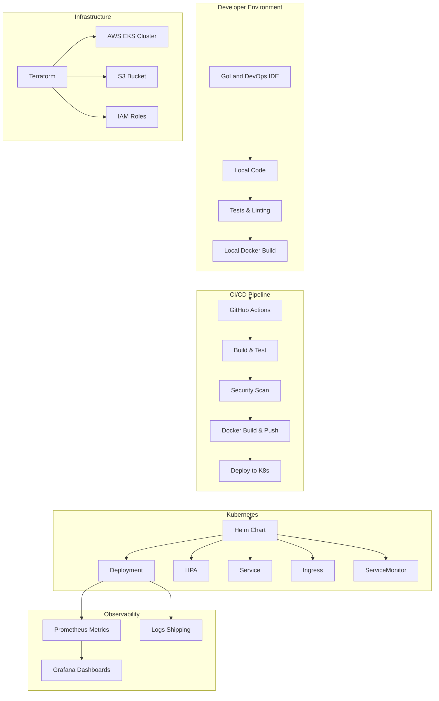

# DevOpsPlus


> From code to cluster in < 5 min with GoLand DevOps IDE.

A production-grade DevOps demo showcasing the power of GoLand DevOps IDE for modern cloud-native development workflows.

## Architecture



## Quick Start

Prerequisites:
- Docker Desktop
- Go 1.22+
- Homebrew

```bash
# Install required tools
brew install terraform helm kind kubectl

# Clone the repository
git clone https://github.com/jetbrains/devopsplus.git
cd devopsplus

# Bootstrap local environment (creates kind cluster and deploys the app)
make bootstrap

# Run the tests
make test

# Tail the logs
make run-logs
```

## Project Structure

```
├── cmd/api/main.go           # Tiny REST API (Go 1.22) with /ping and /healthz
├── internal/                  # Clean-architecture folders
│   ├── handler/               # HTTP handlers with 100% test coverage
│   ├── service/               # Business logic layer
│   └── model/                 # Domain models
├── pkg/metrics/               # Prometheus metrics instrumentation
├── Dockerfile                 # Multi-stage build, non-root user
├── terraform/                 # IaC to spin up an EKS cluster + S3 bucket
│   ├── main.tf                # Cluster + IAM roles
│   ├── variables.tf           # AWS-style variables
│   ├── backend.tf             # S3 + DynamoDB remote state
│   └── terraform.tfvars.example
├── helm/chart/                # Helm v3 chart to deploy the API
│   ├── templates/deployment.yaml
│   ├── templates/hpa.yaml     # Horizontal Pod Autoscaler
│   └── values.yaml            # Dev/Stage/Prod configurations
├── .github/workflows/ci-cd.yml # GitHub Actions pipeline
├── Jenkinsfile                 # Jenkins pipeline definition
└── jenkins/                    # Jenkins configuration files
    ├── README.md               # Jenkins setup instructions
    ├── job-config.xml          # Jenkins job configuration
    └── init.groovy.d/          # Jenkins initialization scripts
        └── init_jenkins.groovy # Automated Jenkins setup
```

## Features

### Go Service

- **Framework**: Chi router for lightweight HTTP routing
- **Graceful Shutdown**: Handles termination signals properly
- **Structured Logging**: Uses zap for high-performance logging
- **Testing**: 100% unit-test coverage for handlers
- **Metrics**: Prometheus instrumentation for observability

### Infrastructure as Code

- **AWS EKS**: Production-ready Kubernetes cluster
- **Remote State**: S3 bucket with DynamoDB locking
- **Security**: IAM roles with least privilege
- **Networking**: VPC with public subnet

### Kubernetes Deployment

- **Helm Chart**: Follows best practices with proper templating
- **Multi-Environment**: Values for dev/staging/prod
- **Autoscaling**: HPA based on CPU and memory metrics
- **Ingress**: External access with TLS support
- **Monitoring**: ServiceMonitor for Prometheus integration

### CI/CD Pipeline

- **GitHub Actions**: Modern CI/CD workflow
- **Jenkins Pipeline**: Alternative CI/CD workflow with Kubernetes integration
- **Security Scanning**: gosec for Go security analysis
- **Container Registry**: GitHub Container Registry integration
- **Automated Deployment**: Helm-based deployment to Kubernetes

### Observability

- **Metrics**: Prometheus endpoint with custom metrics
- **Logging**: Fluent Bit sidecar for log shipping
- **Dashboards**: Grafana dashboard for visualization

## Development Workflow

1. Make code changes in GoLand DevOps IDE
2. Run tests with `make test`
3. Build and run locally with `make run`
4. Build Docker image with `make docker-build`
5. Deploy to local kind cluster with `make deploy`
6. View logs with `make run-logs`

## Production Deployment

For production deployment:

```bash
# Initialize Terraform
cd terraform
terraform init -backend-config="bucket=your-bucket-name" -backend-config="dynamodb_table=your-table-name"

# Apply Terraform configuration
terraform apply

# Deploy to production
make deploy NAMESPACE=prod
```

## Jenkins Setup

The project includes Jenkins configuration for an alternative CI/CD pipeline:

```bash
# Deploy Jenkins to Kubernetes
kubectl apply -f deployments/jenkins/deployment.yaml

# Access Jenkins UI
kubectl port-forward svc/jenkins 8080:8080

# Get initial admin password
kubectl exec -it $(kubectl get pods -l app=jenkins -o jsonpath='{.items[0].metadata.name}') -- cat /var/jenkins_home/secrets/initialAdminPassword
```

After Jenkins is running:

1. Install the required plugins listed in `jenkins/README.md`
2. Set up the credentials as described in `jenkins/README.md`
3. Create a new pipeline job using the provided `jenkins/job-config.xml`
4. Run the pipeline to see the simulated critical failures

For automated Jenkins setup, you can use the provided initialization script:

```bash
# Copy the initialization script to Jenkins
kubectl cp jenkins/init.groovy.d/init_jenkins.groovy jenkins-pod:/var/jenkins_home/init.groovy.d/

# Copy the job configuration to Jenkins
kubectl cp jenkins/job-config.xml jenkins-pod:/var/jenkins_home/

# Restart Jenkins to apply the configuration
kubectl delete pod jenkins-pod
```

See `jenkins/README.md` for detailed instructions and troubleshooting.

## License

MIT
